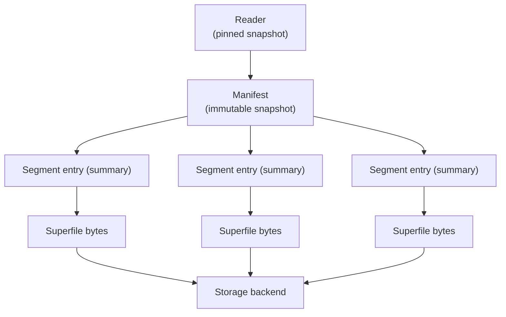

# Supertable

A supertable is infino's table layer over [superfile](./superfile.md)
segments. It presents many immutable superfiles as a single table that
supports SQL, full-text, and vector search, while keeping readers
consistent under concurrent writes.

This document describes the table model and its guarantees. The segment
format is described in [superfile](./superfile.md).

## Design

- **Table over segments.** A supertable is a set of immutable superfile
segments plus a manifest that defines the current contents of the
table.
- **Snapshot reads.** A reader observes a single, consistent snapshot
of the table for its entire lifetime, regardless of writes that land
afterward.
- **Append by commit.** Writes are staged and published as a commit. A
commit produces new segments and a new manifest; it never mutates
existing segments.
- **Pluggable storage.** Segment bytes live behind a storage backend,
and the table layer behaves the same way over in-memory, local-disk,
and object storage.

## Public API

A supertable is the handle an application holds. Its operations are
grouped behind typed accessors so call sites read clearly: a **reader**
for queries against a pinned snapshot, a **writer** for staged changes
published by commit, and a **stats** view for introspection. The
manifest and segment internals behind these accessors are never part of
the surface.

Operations fall into two groups: **Read** and **Write**.

### Read

Reads run through a **reader** — a snapshot pinned at the moment it is
taken, so a sequence of queries observes one consistent view of the
table regardless of concurrent writes.

Every read returns the same shape: a list of hits. A hit references a
single row by its segment and the row's offset within that segment,
plus a score when the query ranks results. BM25 fills the score with
relevance (higher is better); vector search fills it with distance
under the column's metric (smaller is closer); a SQL filter leaves it
unset.

- **Vector search.** k-nearest-neighbor over a vector column for a
query vector, returning the `k` closest rows ordered by ascending
distance. Per-query recall/latency knobs (number of clusters probed,
rerank breadth) are passed as search options.
- **Full-text search.** BM25 over a text column for a query string,
returning the `k` highest-scoring rows ordered by descending score.
Search options carry the boolean combination mode (match any term or
all terms) and default to matching any term.
- **Full-text prefix search.** BM25 over a text column where the query
is expanded as a term prefix, returning the `k` highest-scoring rows.
- **Token match.** The *unranked* counterpart of full-text search:
given a token list and a combination mode, return every row whose
text contains all the tokens (`And`) or any of them (`Or`). No
scoring and no top-k — the score is left unset. This is a set
membership question ("which rows match"), not a ranking.
- **Exact match.** Given a raw string, return every row whose stored
value equals that string exactly. It runs in two passes — a token
match prunes candidate rows from the index, then the candidates' text
is verified against the raw string — so it never scans the whole
column. Tokenization is used only to prune; the match itself is a
raw-string comparison. Also unranked.
- **SQL.** A SQL query over the table's scalar and full-text columns,
returning the matching rows. Search is also reachable from SQL
through table-valued functions, so a query can filter, project, join,
and order search results alongside scalar columns:
  - `vector_search(column, query, k)` — vector kNN as a relation.
  - `bm25_search(column, query, k)` and
  `bm25_search_prefix(column, prefix, k)` — full-text / prefix BM25.
  - `token_match(column, query, mode)` and `exact_match(column, value)`
  — the unranked token / exact-match relations. Negation is then a
  SQL composition over them (e.g. `token_match(..,'rust') EXCEPT token_match(..,'compiler')`), keeping it index-bounded rather than a
  dedicated `NOT` engine feature.
  - `hybrid_search(text_col, q_text, vec_col, q_vec, k)` — BM25 and
  vector results fused with reciprocal-rank fusion into one `score`.
  Because each retriever is a relation, hybrid ranking is ordinary SQL
  composition: join or union `vector_search` and `bm25_search` and rank
  by a fusion score. `hybrid_search` packages the most common fusion as
  a single function.
  Each function runs against the reader's pinned snapshot and yields
  the table's `_id`, the projected scalar columns, and a `score`. Vector
  columns are never scanned as SQL columns — they live in the segment's
  embedded blob — so they are reached only through `vector_search` (or
  `hybrid_search`, which calls it).

The reader also answers cheap snapshot questions — segment count,
document count, manifest identity — without touching segment bytes. A
separate **stats** view adds process-level observability (cache
residency, resident memory) for the whole table.

### Write

Writes run through a **writer**: changes are staged on it and made
durable by a single commit; nothing is persisted until commit
succeeds. A commit applies all staged work atomically from the
caller's perspective.

- **Append.** Stage a batch of rows for insertion.
- **Delete.** Stage the removal of every row matching a predicate. The
predicate is resolved against the current snapshot at call time.
- **Update.** Stage a 1:1 replacement of every row matching a
predicate with a supplied batch of equal cardinality.
- **Commit.** Flush all staged appends, updates, and deletes,
publishing a new snapshot of the table.

### Lifecycle

A table is created or opened from a set of options (schema, indexed
columns, tokenizer, storage backend, consistency policy). The options
used to construct the table are readable back from the handle. Read
freshness under concurrent writers is governed by the configured
consistency policy and applied by the engine on every read; callers
never refresh by hand.

## Manifest

The manifest is the source of truth for which segments make up the
table at a point in time. It holds table-level configuration (schema,
indexed columns, tokenizer) and an ordered list of segment entries.

The manifest is immutable. Each commit builds a successor manifest and
publishes it atomically; a reader pins the manifest current at the time
it was created and never observes a partially applied commit.
Successor manifests share the segment entries they carry forward, so
publishing a commit allocates only the new entries rather than copying
the whole list.

Each segment entry is a summary of one superfile, holding the
information the table layer needs to route and prune queries without
reading the segment bytes:

- **Location.** A storage-backend identifier for the segment's bytes.
- **Row range.** The segment's document count and the range of primary
identifiers it covers.
- **Scalar statistics.** Per-column minimum and maximum values for the
scalar columns, used to skip segments for predicate queries.
- **Full-text summary.** Per text column, a term presence filter (a
bloom filter over the segment's terms) and the lexicographic range of
its terms, used to skip segments for term and prefix queries.
- **Vector summary.** Per vector column, a representative centroid and
radius, used to order and route vector queries.

The segment bytes themselves are held by the storage backend, not the
manifest, so a manifest stays small and cheap to share across many
concurrent readers.

### Partitioned, hierarchical manifest

At scale the entry list is not a single flat array. Segments are
assigned to partitions by a partition strategy that is chosen when the
table is created and is immutable thereafter. Within a partition,
entries are grouped into manifest *parts*; a new commit's segments
append to a partition's current part until that part crosses a soft
cap on either entry count or compressed size, at which point the next
commit starts a fresh part rather than rewriting the existing one. A
top-level manifest list names the parts and carries the per-part
aggregate summaries used for pruning, so a query can discard whole
parts before touching any per-segment entry.

Parts load on one of two paths, selected by a threshold on part count:

- **Eager.** For a small number of parts, opening the table
parallel-fetches every part up front and exposes the flat union of
their entries. This is the path the flat-iteration query APIs use.
- **Lazy.** Above the threshold, parts are left unloaded and fetched
on first access, so opening a large table does not pull every part
into memory. Coalesced loading ensures concurrent readers of a cold
part share a single fetch.

## Commit pipeline

A commit turns staged record batches into new segments and a new
manifest. It runs in the following stages:

- **Stage.** Appended record batches accumulate in a write buffer. A
commit consumes the current buffer; a size threshold can also trigger
a commit automatically to bound the buffer's footprint.
- **Shard.** The buffered rows are partitioned into balanced shards so
that segment builds run in parallel, independent of how the caller
batched its appends.
- **Build.** Each shard is built into one superfile, including its
full-text and vector indexes, on a worker pool.
- **Summarize.** Each new segment's manifest entry is derived — row
range, scalar statistics, and the full-text and vector summaries.
- **Publish.** The segment bytes are written to the storage backend and
a successor manifest containing the existing and new entries is
published atomically.

## Storage

Segment files are stored as ordinary Parquet files. The manifest is a
catalog over those files; it does not change the segment format. Any
Parquet reader can open an individual segment file and read its
columnar data directly, ignoring the embedded indexes.

For persistent tables, the storage backend holds three things: the
segment files, the manifest, and a pointer to the current manifest.
Publishing a commit writes the new segments and manifest first, then
swings the pointer in a single atomic step, so a reader resolving the
pointer always lands on a complete manifest. When multiple processes
write the same table, the pointer update is guarded so that a writer
working from a stale manifest cannot silently overwrite another
writer's commit: a conflicting publish is retried with backoff,
refreshing from the current manifest and rebuilding on top, up to a
bounded number of attempts before the commit surfaces a contention
error.

Segment uploads adapt to size. Below a configurable threshold a
segment is written in a single put; at or above it the upload is split
into fixed-size chunks driven in parallel, which lowers peak memory
during the write and limits the cost of a transient backend failure
mid-upload.

Range reads are exact-or-error. A read for a byte range yields exactly
that many bytes or a typed error — a reader never sees a silently short
buffer. Recovering from transient backend truncation or connection
flakiness sits beneath this contract, in the storage layer.

Readers may verify the segment's embedded checksums when opening it.
This is on by default and can be turned off when the underlying
storage already guarantees integrity (a content-addressed object
store, a checksumming filesystem), trading that guarantee for faster
cold opens.

## Disk cache

When a table is backed by remote storage, an optional disk cache keeps
hot segments local. A cold query is served from remote byte ranges
while the full segment is fetched in the background; once a segment is
resident it is served from a local memory-mapped file. The cache tracks
residency per segment and is bounded by a configurable budget, evicting
cold segments when the budget is reached.

The cache distinguishes on-disk residency from memory residency. An
optional memory budget bounds the mapped working set rather than the
on-disk set: when the resident pages exceed the budget, the oldest
entries are advised out of memory while their backing files stay on
disk, so pages re-fault on next access without a re-download. Eviction
is safe during use because an open reader keeps its mapping alive even
after the on-disk file is unlinked, so in-flight queries finish
correctly and eviction is only ever a reclaim-and-refetch cost.

## Queries

SQL, full-text, and vector search share the same fan-out shape:

1. Start from the reader's pinned manifest.
2. Use the manifest summaries to skip segments that cannot match the
  query.
3. Run the per-segment query against each remaining segment in
  parallel.
4. Merge the per-segment results into a single ranked result for the
  table.

Skip pruning reads only the manifest summaries, never the segment
bytes, and is always conservative: when the manifest cannot prove a
segment is irrelevant, the segment is kept. The pruning inputs are:

- **Term queries** use each segment's term presence filter.
- **Prefix queries** use each segment's lexicographic term range.
- **Predicate (SQL) queries** use the per-column scalar statistics.
- **Vector queries** use the per-column vector summary to order and
route work.

Pruning can remove work but never a correct result; a kept segment that
turns out not to match only costs a per-segment query, while a segment
is never wrongly dropped.

Full-text and vector search delegate to each segment's index (the same
search the single-segment reader runs) and merge globally. SQL is
executed over the columnar (Parquet) data and does not require the
search indexes — but it can still reach them through the search
table-valued functions (`vector_search`, `bm25_search`,
`bm25_search_prefix`, `token_match`, `exact_match`), which run the same
per-segment index fan-out and hand their results back into the SQL plan
as a relation.

A SQL `WHERE` predicate on a full-text column also uses the index
directly, as the **row-level** companion to the segment-level term
skip: an equality (and its `AND`/`OR`/`IN` combinations) is resolved
through the term postings to a candidate set of rows, so only those
rows are decoded and the engine re-checks the exact predicate over
them — instead of decoding the whole column and filtering. A predicate
the index cannot bound (negation, range, a non-indexed column) falls
back to a column scan. So a selective filter on an indexed text column
reads work proportional to the matches, not the column size. A hybrid
ranking is then expressed *in SQL* — fuse the `vector_search` and
`bm25_search` relations with a join/union and a fusion score. The
`hybrid_search` table function is a convenience that packages the
common case: it runs the BM25 and vector kernels concurrently and fuses
the two rankings with reciprocal-rank fusion, so a row surfaced by both
retrievers ranks above one surfaced by a single retriever. It is a
SQL-level fusion, not a separate engine kernel.

## Concurrency

- **Reader/writer isolation.** Reads and writes do not block each
other. A reader holds an immutable manifest snapshot; a writer builds
new segments and a new manifest independently.
- **Atomic publication.** A reader sees either the manifest before a
commit or the manifest after it, never an intermediate state.
- **Single writer.** One writer is active per table at a time.
- **Separate pools.** Query fan-out and segment builds use separate
worker pools, so background writes do not starve foreground reads.

## Scope

- Segments are immutable; updates are expressed by publishing a new
manifest over different segments.
- One writer is active per table at a time.
- Full-text and vector search are distinct query paths; combined
relevance scoring is left to the caller.

